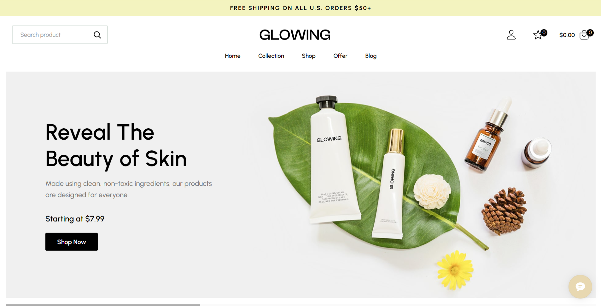
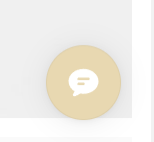
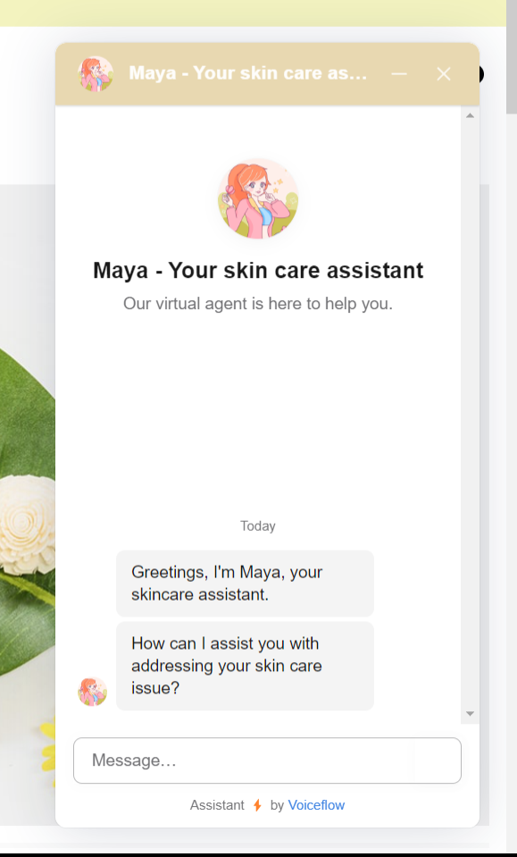
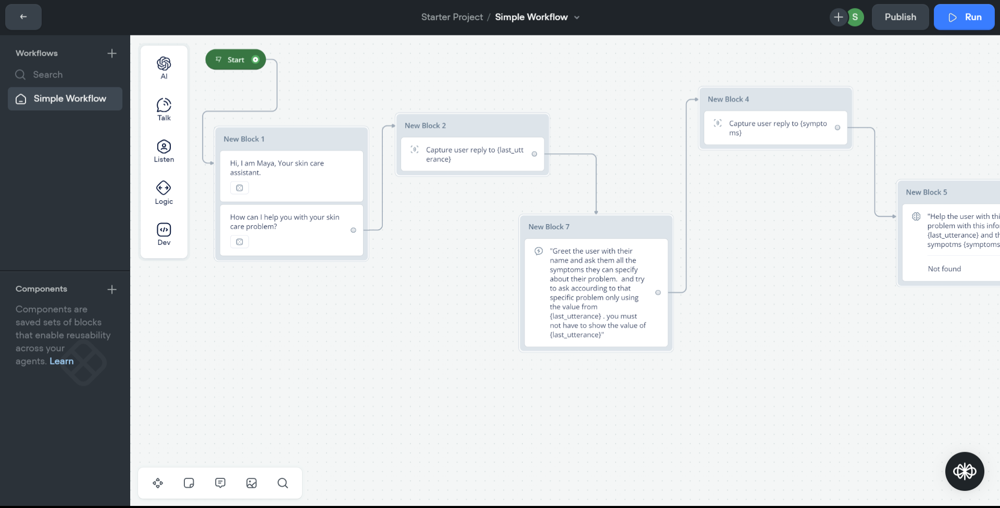

# Maya -AI skin care chatbot

Maya is a AI skincare chatbot created using voiceflow to help you out with your skin care problems.

Maya is provide the solution based on the information she is trained and always try to give the appropriate solutions.

## How to use Maya

1. Open the website link: https://maya-ai-chat-bot.vercel.app/

2. Open the chat using this icon on bottom right of the page.

3. Start chat with Maya and solve your problems.

## Wrokflow of MAYA

Maya is created using voiceflow and the workflow of maya is also created in voiceflow.

link to workflow: https://creator.voiceflow.com/workspace/accept-invite?inviteToken=eyJhbGciOiJkaXIiLCJlbmMiOiJBMjU2R0NNIn0..3xxOhmpGx_lNg2Z3.B7FDXz1xBw0DoDdtMDo7wP4kk9qQ27tXxqkFr5SmowK0PSwq8ZFP60_7G3AYHq6h_0DXl4spJ8EKdtK0I0G8kgoz4lEyghSxZUTd2nSYHLJU8_I0DZ8.wTm6zgQqHe-tGN1ETADg_g

